# RIP Routing
RIP là một giao thức định tuyến động (dynamic routing protocol) thuộc distance-vector routing.  
Nó cho phép các router trao đổi thông tin bảng định tuyến với nhau, để tự động học được đường đi đến các mạng khác mà không cần cấu hình static route thủ công.  

## Đặc điểm chính của RIP
- Thuộc loại: Distance-vector (dựa vào số hop count để chọn đường đi).
- Metric: Số hop (mỗi router đi qua tính là 1 hop).
- Giới hạn: Tối đa 15 hop, nếu xa hơn coi như không reach.
- Cập nhật: Định kỳ gửi toàn bộ bảng định tuyến cho láng giềng sau mỗi 30 giây (broadcast/multicast).
- Dễ cấu hình nhưng không tối ưu cho mạng lớn do giới hạn hop và tốc độ hội tụ chậm.

## Sơ đồ mạng RIP
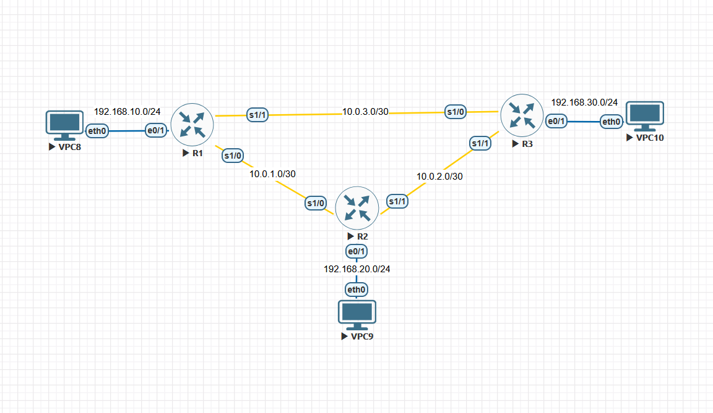  
  
## Cấu hình RIPv2
### Cấu hình IP
#### R1
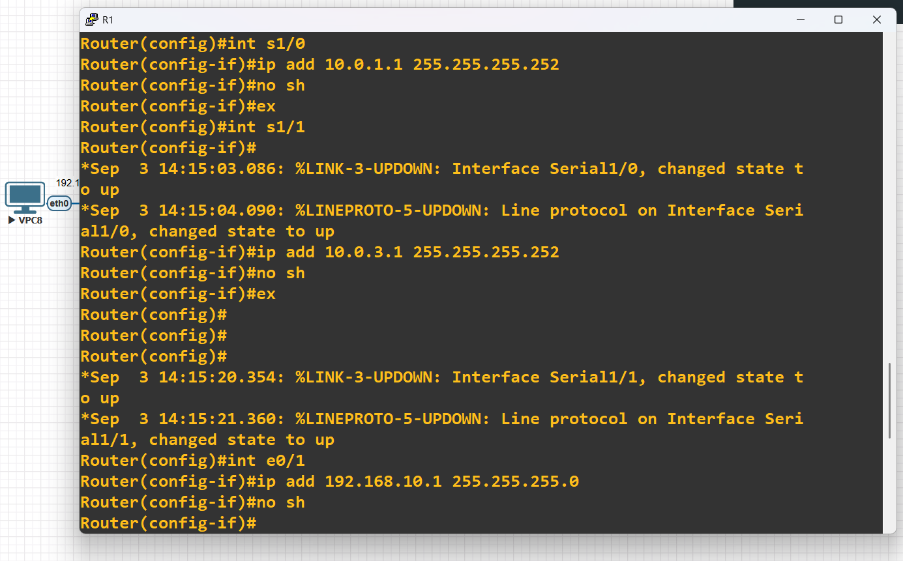  
#### R2
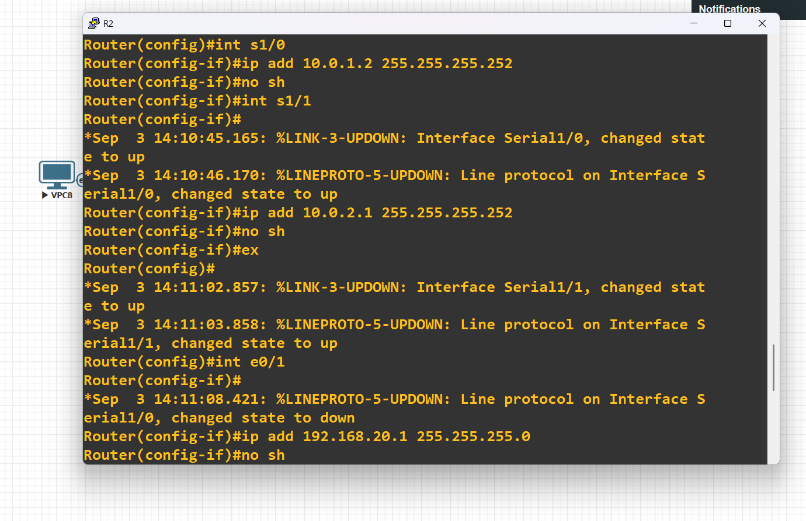  
#### R3
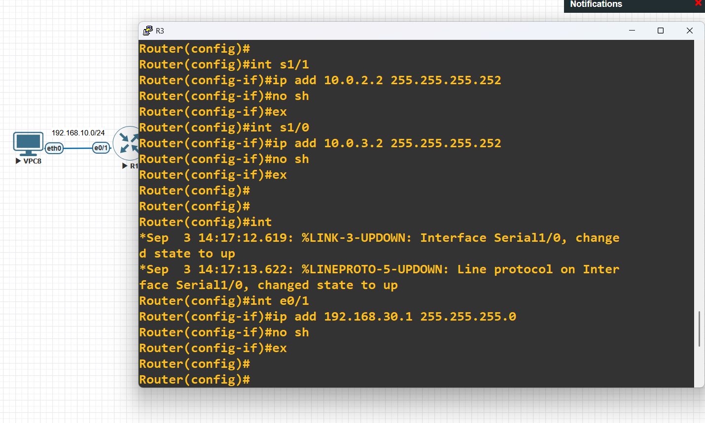  
  
### Cấu hình RIPv2
#### R1
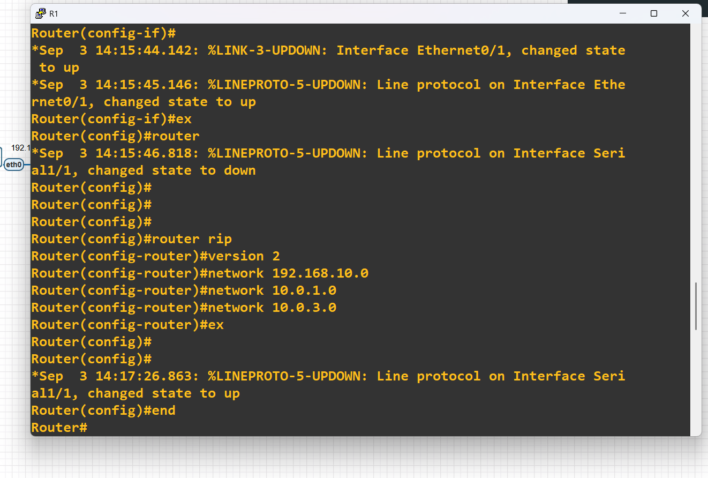  
#### R2
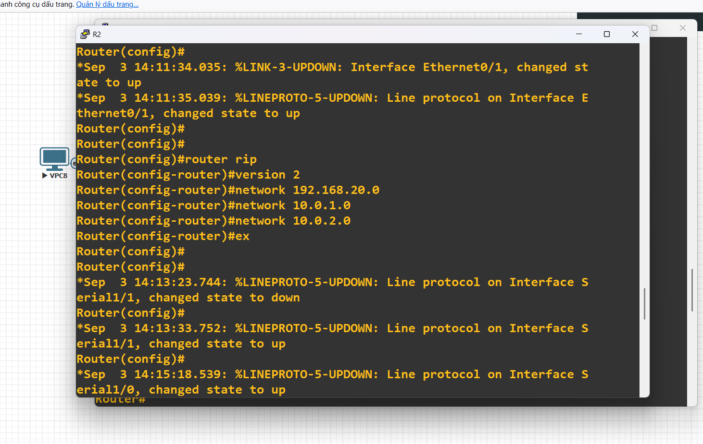  
#### R3
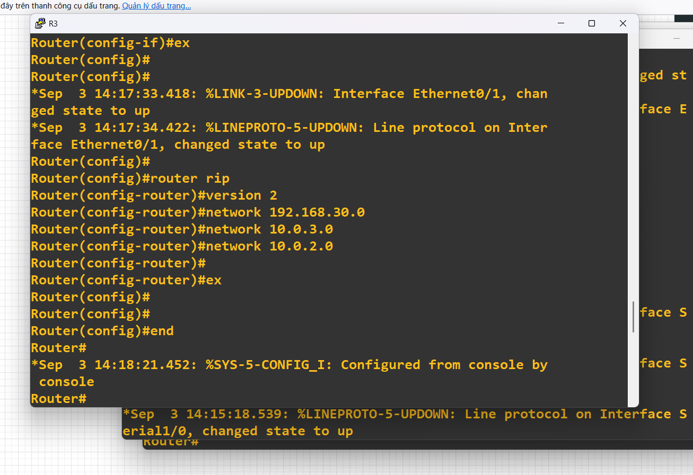  
  
### Kiểm tra cấu hình RIPv2
#### R1
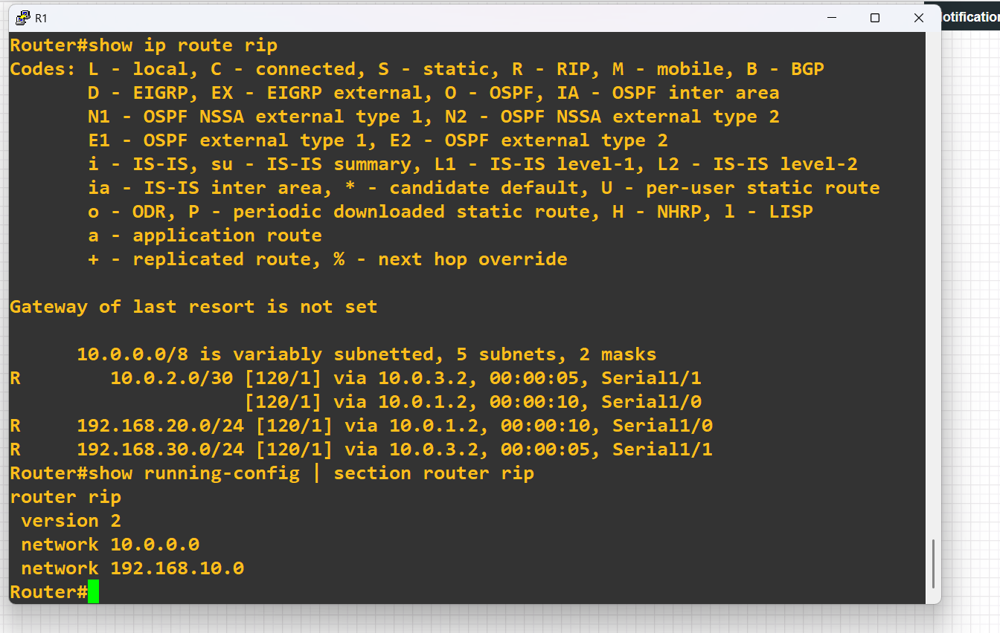  
#### R2
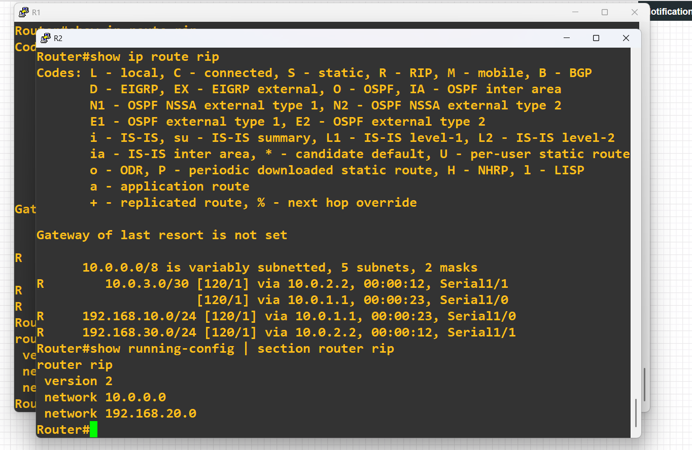  
#### R3
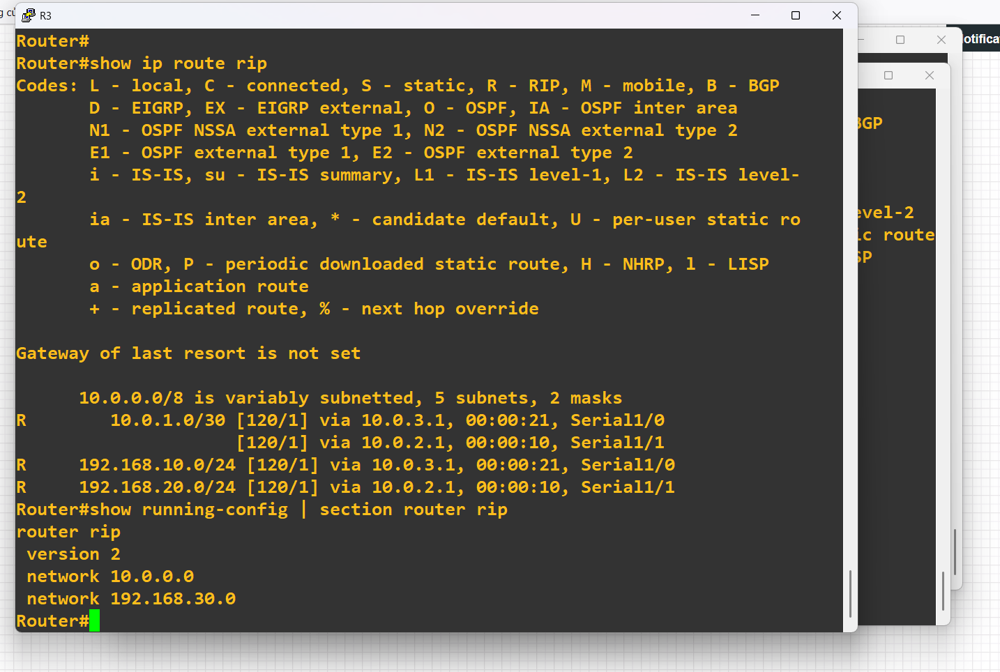  
  
### Kiểm tra kết nối
#### VPC1
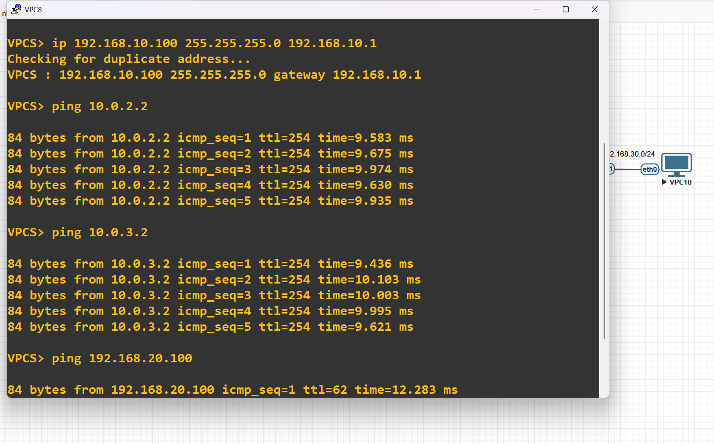  
#### VPC2
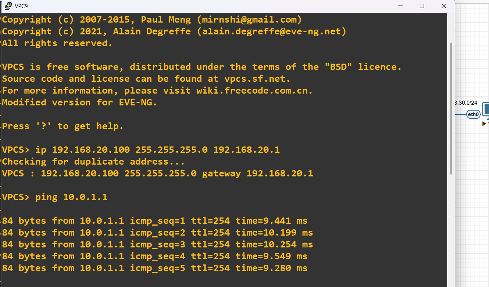  
#### VPC3
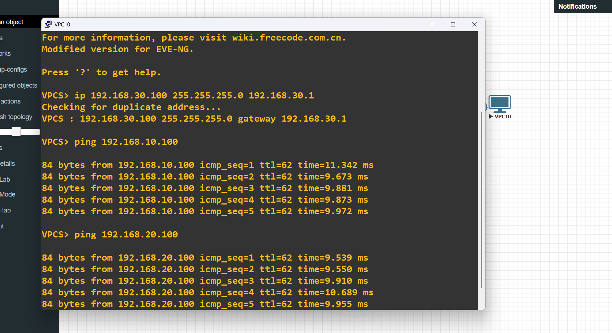  
  
