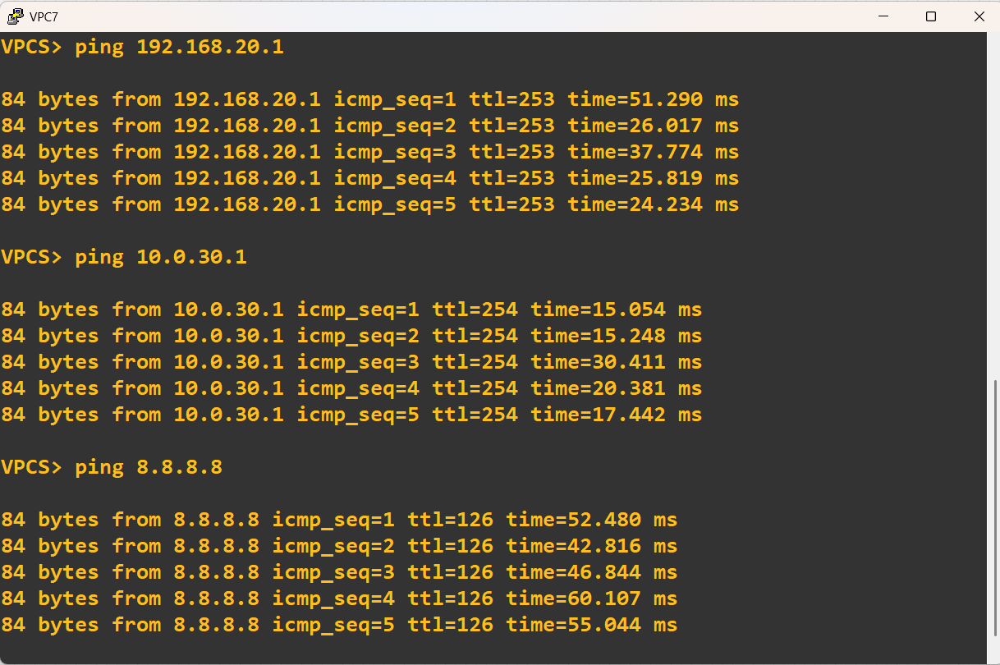

# OSPF (Multi-area)
## Mô tả tổng quan sơ đồ

Đây là mạng WAN mô phỏng với OSPF multi-area, có 4 router chính (R1, R2, R3, R4) kết nối với nhau, kèm theo các máy PC (VPC7, VPC8, VPC9).  
Mạng được chia thành các area trong OSPF:  
- Area 0 (Backbone area): kết nối giữa R1 và R4.  
- Area 1: kết nối giữa R2 ↔ R4.  
- Area 2: kết nối giữa R3 ↔ R4.

R4 với vai trò là Core Router / ABR (Area Border Router):  
- Trung tâm mạng WAN, kết nối giữa backbone Area 0 và các area khác.  
- Làm ABR: kết nối nhiều area trong OSPF.

## Cấu hình OSPF (Multi-area)
Đặt IP cho từng router:
R1:  
  
R2:  
  
R3:  
   
R4:  
  
  
Cấu hình OSPF:  
R1:  
  
R2:  
  
R3:  
  
R4:  
  
  
Kết nối internet cho các area khác.  
  

Kiểm tra neighbor:  
    
Kiểm tra kết nối:  
VPC7:  
  
VPC8:  
  

